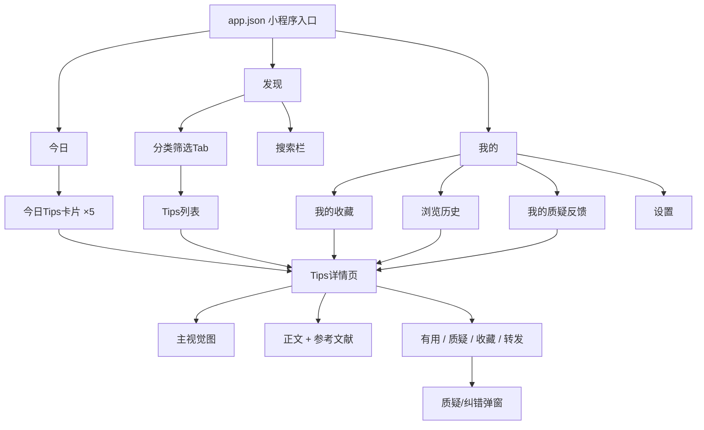

# 格物致知 — 信息架构文档 (IA)

> **项目类型**：微信小程序
> **更新日期**：2026-05-21
> **版本**：MVP v1.0

---

## 1. 项目概述

### 一句话定位
每日推送 5 条有科学依据的生活消费小知识，帮助普通人减少选错商品、被谣言误导、花冤枉钱的情况。

### 目标用户
- 没有系统理工科背景的普通消费者
- 对食品、日用品选购有困惑、容易被营销话术带偏的人
- 愿意把实用知识转发给家人的"家庭科普员"

### 北极星指标
用户读完 tip → 转发给家人/朋友；翻看往期 tip 库形成回访习惯。

### 内容五大分类
| 分类 | 示例选题 |
|---|---|
| 日用材质 | 塑料餐盒认 PP5、拖鞋选 EVA、不锈钢 304 vs 201 |
| 食品真相 | 味精非化工合成、防腐剂不是毒药、零添加营销话术拆解 |
| 护肤品真言 | 成分表怎么看、烟酰胺/视黄醇科普、大牌平替真相 |
| 农工辟谣 | 转基因科普、农药残留真相、激素鸡谣言 |
| 健康科普 | 发烧该不该捂汗、维生素别乱补、抗生素≠消炎药 |

---

## 2. 站点地图 (Sitemap)



---

## 3. 用户路径

### 路径一：每日主路径（北极星路径）
```
打开小程序 → 首页「今日」→ 上下滑动浏览 5 条卡片
→ 看到有价值的 → 点击「转发」分享到家人群/朋友圈
→ 或点击卡片进入详情页 → 阅读完整内容 → 转发
```

### 路径二：回访浏览路径
```
打开小程序 → 底部Tab切换到「发现」
→ 点击顶部分类Tab筛选（如只看「护肤品真言」）
→ 或使用搜索栏搜索关键词
→ 点击列表项进入详情页 → 收藏 / 转发
```

### 路径三：裂变进入路径
```
朋友分享的Tips详情页 → 阅读内容
→ 点击底部「去看看今天的Tips」→ 进入小程序首页
→ 完成主路径（浏览、收藏、转发）
```

### 路径四：质疑反馈路径
```
任意Tips卡片/详情页 → 点击「质疑」→ 弹出质疑表单
→ 填写质疑理由（可选附参考文献）
→ 勾选身份 → 提交
→ 运营后台审核 → 若属实，更新内容并公开感谢勘误者
```

### 路径五：收藏查阅路径
```
首页/详情页 → 点击「收藏」
→ 日后购物场景 → 打开小程序 → 「我的」→ 「我的收藏」
→ 按分类快速定位 → 点击进入详情页查看具体判断标准
```

---

## 4. 核心页面内容模块清单

### 4.1 首页「今日」

**页面定位**：用户每天打开的第一眼，5 个分类各推一条当日最新 tip。

**内容元件清单**：

- **日期区**
  - 当日日期（年/月/日 + 星期）
  - 页面副标题文案（如"格物致知 · 今日5篇"）

- **Tips 卡片 ×5**（每条卡片包含以下元件）
  - 分类标签（日用材质 / 食品真相 / 护肤品真言 / 农工辟谣 / 健康科普）
  - 主视觉图（与 tip 主题相关的科普插图/对比图/标识特写）
  - 一句话结论标题（15 字以内，口语化、有冲击力）
  - 简短解释正文（2-3 句，说明"为什么"）
  - 三个反馈按钮：`👍 有用` `😐 不感兴趣` `🤔 质疑`

- **底部导航栏**
  - 三个 Tab：📅今日 / 🔍发现 / 👤我的
  - 当前页 Tab 高亮态

**交互行为**：
- 点击卡片主体 → 进入该条 Tips 详情页
- 点击「有用」→ 记录反馈 + 轻提示"感谢反馈"
- 点击「不感兴趣」→ 记录反馈，可后续用于个性化排序
- 点击「质疑」→ 弹出质疑/纠错弹窗
- 卡片支持上下滑动浏览，当日 5 条全部加载

---

### 4.2 「发现」长廊

**页面定位**：往期全部 tips 的可搜索、可分类浏览的内容库。

**内容元件清单**：

- **搜索栏**
  - 搜索框（placeholder："搜索往期Tips..."）
  - 触发搜索后展示结果列表

- **分类筛选 Tab 栏**
  - 5 个分类标签，可横向滑动或固定一行
  - 默认选中「全部」，点击切换分类

- **Tips 列表**
  - 每条列表项包含：日期（月/日）、标题、收藏状态图标（⭐）
  - 按日期倒序排列
  - 支持上拉加载更多（分页）

- **底部导航栏**
  - 同首页，当前为「发现」高亮

**交互行为**：
- 点击列表项 → 进入 Tips 详情页
- 切换分类 Tab → 列表刷新为对应分类内容
- 搜索输入 → 标题/正文关键词匹配

---

### 4.3 Tips 详情页（分享落地页）

**页面定位**：单条 tip 的完整展示页，也是裂变分享的落地页。

**内容元件清单**：

- **顶部导航**
  - 返回按钮（`←` 或 `<`）
  - 页面标题（可为空，由内容区主导）

- **主视觉区**
  - 大尺寸主题配图（与卡片同主题，尺寸更大/更清晰）
  - 分类标签

- **正文区**
  - 标题（一句话结论，字体醒目）
  - 正文内容（支持多段落、列表、对比说明等富文本结构）
  - 核心判断标准/选购口诀（如"认准底部△标里的数字5和PP字样"）

- **参考文献区**
  - 引用来源列表（如国家标准号、论文标题、权威机构名称）
  - 格式：简洁可读，非学术规范级别，重在可信度

- **互动操作栏**
  - `👍 有用` 按钮（展示累计有用数）
  - `🤔 质疑/纠错` 按钮
  - `📤 转发` 按钮（触发微信转发）
  - `⭐ 收藏` 按钮（toggle 态）

- **底部引流区**
  - 文案："来自「格物致知」小程序"
  - 行动入口："→ 去看看今天的 Tips"
  - 点击跳转至首页「今日」

**交互行为**：
- 返回按钮 → 返回上一页
- 收藏按钮 → toggle 收藏状态，同步更新「我的收藏」
- 转发按钮 → 调起微信分享接口，分享卡片标题为 tip 一句话结论
- 底部引流入口 → 跳转首页（switchTab）
- 质疑按钮 → 弹出质疑弹窗
- 有用按钮 → 记录反馈 + 累计数 +1

---

### 4.4 「我的」

**页面定位**：用户个人中心，收藏、历史、反馈的聚合入口。

**内容元件清单**：

- **用户信息区**
  - 头像（微信头像）
  - 昵称（微信昵称）

- **功能入口列表**
  - `⭐ 我的收藏` — 右侧显示收藏总数，点击进入收藏列表
  - `📖 浏览历史` — 点击进入历史列表
  - `✍️ 我的质疑反馈` — 右侧显示提交数，点击进入反馈记录列表
  - `⚙️ 设置` — 点击进入设置页

- **页脚信息区**
  - 关于我们 / 用户协议 / 隐私政策（三个文本链接）

- **底部导航栏**
  - 同首页，当前为「我的」高亮

**交互行为**：
- 点击各入口 → 进入对应子页面
- 关于我们/用户协议/隐私政策 → 进入富文本静态页面

---

### 4.5 质疑/纠错弹窗

**页面定位**：用户反馈内容的入口，也是信任建设的关键触点。

**内容元件清单**：

- **弹窗标题**
  - "这篇 Tips 可能有误？"

- **输入区**
  - 多行文本输入框（placeholder："请告诉我们哪里不对…"）
  - 可选附件上传入口（图片或链接，用于提供参考文献截图）

- **身份标注（选填）**
  - 单选组，选项：
    - 相关专业学生
    - 行业从业者
    - 学术研究者
    - 只是懂这个的普通人

- **操作按钮**
  - `取消`（关闭弹窗，不提交）
  - `提交反馈`（提交后关闭弹窗，轻提示"感谢反馈，我们会认真核实"）

**交互行为**：
- 质疑理由为必填，身份为选填
- 提交后数据进入运营后台待审核队列
- 若质疑被采纳 → 运营更新内容 + 通过模板消息通知提交者（如有订阅）

---

## 5. 全局约束与设计原则

### 5.1 微信小程序硬约束
- 框架：WXML + WXSS + JavaScript + JSON，无第三方前端框架
- API：全部使用 `wx.*` 原生接口
- 转发：使用 `<button open-type="share">` 实现分享
- 页面路由：所有页面必须在 `app.json` 中注册
- 底部 Tab：使用 `app.json` 的 `tabBar` 配置实现 3 个 tab 切换

### 5.2 内容运营约束（MVP 阶段范围外但需预留接口）
- 质疑反馈管理后台（运营审核/回复/更新内容）
- 每日 5 条内容的 CMS 后台（排期/发布/修改）
- 用户反馈数据统计面板

### 5.3 设计原则
- 卡片式信息呈现，单条可独立转发
- 主视觉图是内容的核心载体，需支持图片优先的排版
- 文字简洁、口语化，面向非专业读者
- 质疑入口始终可见，传递"我们接受纠正"的姿态

---

## 6. 附录：待后续阶段确认事项

1. **主视觉图来源**：自绘插画？摄影素材？信息图排版？需在设计阶段确定风格方向
2. **CMS 选型**：自建后台？使用微信云开发？内容量小时可先用静态数据
3. **个性化推荐**：MVP 阶段每日固定推送 5 条，后续可根据"不感兴趣"反馈做排序调整
4. **推送通知**：是否需要模板消息提醒用户"今天的 Tips 已更新"？涉及订阅消息申请
